# Vehicle Related Action Classification

### Data

- VIRAT has 214 videos
- 7 scenarios / backgrounds from which VP need to be estimated
  - Only one seems to be wrong from the first frame

### Extract Frames

- **Input:** Video
- **Output:** List of path where the frames are located
- Use Ffmpeg 

### Vehicle Contour 

- **Input:** Mask-RCNN segmentation result
- **Output:** Vehicle Contour image patch on frame
- Process contour from Mask-RCNN segmentation to obtain contour

### Vanishing Points

- **Input:** First frame of video
- **Output:** 
- Processing:
  - Gets parallel lines through CNN
  - Clusters parallel lines considering as similarity mtric the angle between lines
  - Estimate VP
  - Number of VP is a predefined value set to 3

### 3DBBox

- **Input:** the image, VPs, Position of Vehicle, Vehicle Contour
- **Output:** 3DBBox

### Orientation

- **Input:** 3DBBox in image
- **Output:** List of orientation vectors