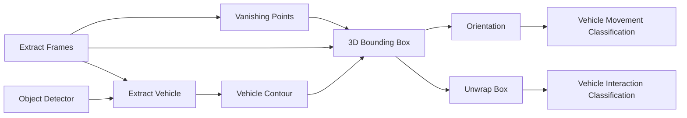

# Vehicle Related Action Classification

### Data

- VIRAT has 214 videos
- 7 scenarios / backgrounds from which VP need to be estimated
  - Only one seems to be wrong from the first frame
  - 

### Extract Frames

- Input: Video
- Use Ffmpeg 
- Ask if frames were already extracted along with the annotations

### Vehicle Contour 

- Use Mask-RCNN segmentation for the contour

### Vanishing Points

- Input: First frame of video
- Get parallel lines from CNN
- Cluster the parallel lines based on angle between the lines
- Number of VP is a predefined value

### 3DBBox

- Input: the image, VPs, Position of Vehicle, Vehicle Contour

### Orientation

- Input: Sequence of 3DBBox
- 

